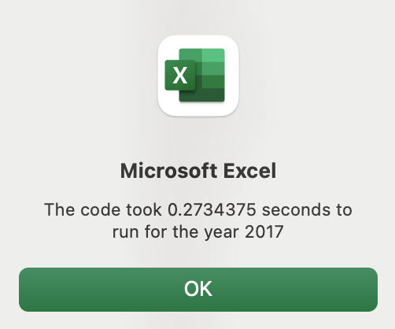
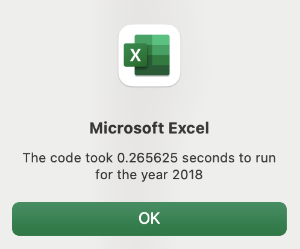

# Stock-Analysis
## Overview of Project
The purpose of this analysis is to help Steve determine whether or not DQ is a good stock for his clients to continue to invest in. It is also being used to determine if his clients should diversify their stock portfolio more, and what other stocks would be good for them to add to their portfolio.

## Results

### All Stock Data Results

Below are images of the analysis results for 2017 and 2018.

#### 2017 Results for All Stocks

#### 2018 Results for All Stocks

I generated a worksheet that pulled data in for twelve different stocks for the years 2017 and 2018. By creating a VBA macro I was able to make populating the stock results for both years individually easier for Steve with the press of a button. The coding I used in my macro is activated when Steve presses the "Run Analysis for All Stocks" button, prompting an input box where he fills in which year he is interested in viewing the data from. When he done reviewing the data for one year, he can clear the worksheet with the "Clear Data" button and start all over again with the "Run Analysis for All Stocks" button. As we can see in the above images, the return on all stocks, except TERP, was positive for the year 2017. The return on all the stocks for 2018, with the exception of ENPH and RUN, were negative. From this information we can see that Steve's clients should probably diversify their portfolio more by investing in more than just the DQ stock, as the DQ stock performance didn't do as well in 2018 as it did in 2017. 

### Script Execution Time Results

Below are images showing the script execution times for my original macros as compared to my refactored macros.

#### 2017 Original Script Execution Time

#### 2018 Original Script Execution Time

The above images show how quickly my original macro for "All Stocks Analysis" executed the code for each individual year.  

#### 2017 Refactored Script Execution Time

#### 2018 Refactored Script Execution Time

Knowing Steve may want to add more stocks in his future analyses, which could lead to a much larger data file, I refactored my original macro to make the coding execution time much quicker. By comparing the execution times above, we can see that the refactored code executes much quicker than the original code did, which can help save a decent amount of time if there are much more rows of data added to the stock worksheets. 

## Summary

### Advantages/Disadvantages of Refactoring Code
The only disadvantage I can think of for refactoring code is that it takes extra time to go through and make the code better. On that note, that disadvantage is greatly outweighed by the advantage of making the code work much more quickly and efficiently. Since you are basically cleaning up your code when you refactor, you also make your code easier to understand and follow.

### How Pros/Cons Apply to Refactoring the Original VBA Script for All Stocks Analysis.
The con applied to the refactoring of the original VBA script by the time taken to review my original code and figuring out how to make the original code run more efficiently. The pro applied to the refactoring by greatly decreasing the time it took the code to give me the same results as my original code. I was also able to not have such a long macro even though I had the formatting for the worksheet in the same macro on my refactored macro. Originally I had a macro for pulling the data and outputting it in the "All Stocks Analysis" worksheet as well as separate macros for formatting and clearing the "All Stocks Analysis" worksheet. By refactoring I was also able to delete a button I created when I did my original macros.
